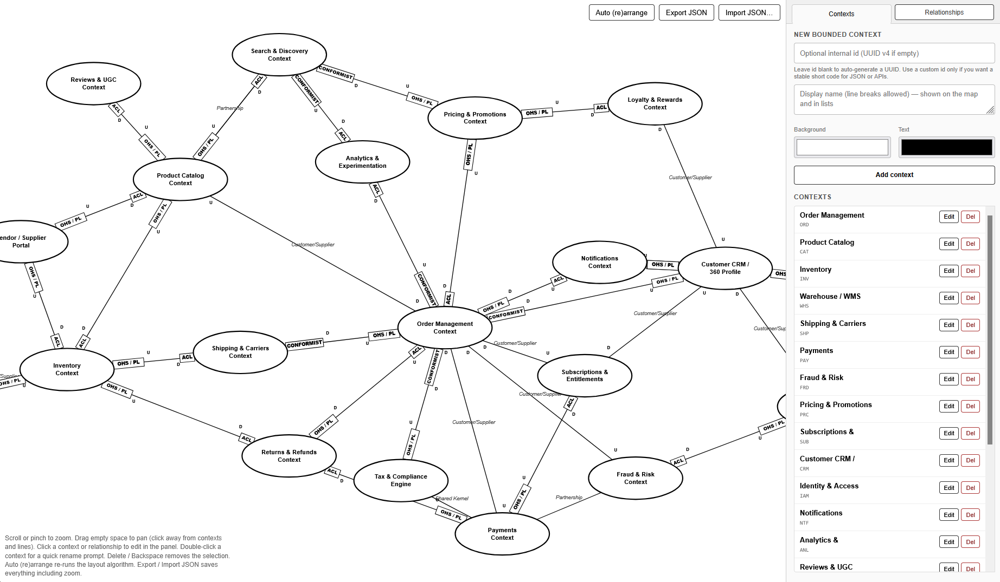

# DDD Context Mapper

## Description

**DDD Context Mapper** is a browser-based diagram editor for [Domain-Driven Design (DDD) context maps](https://www.domainlanguage.com/ddd/patterns/DDD_Reference_2011-01-31.pdf). You draw **bounded contexts** as ellipses and connect them with **directed relationships** that can carry DDD-style labels (for example Customer/Supplier, Shared Kernel, Anti-Corruption Layer) and upstream/downstream markers.

The app is a single static page (`context-mapper.html`) that uses [D3.js](https://d3js.org/) for layout and interaction. No build step or server is required to open and use it locally.

## What it is for

In DDD, a **context map** is a sketch of how distinct **bounded contexts** depend on each other. This tool helps you:

- **Name and place** contexts on a canvas and adjust their colors.
- **Link** contexts with arrows and annotate both ends (boxes, U/D markers, middle labels) so the diagram matches common context-mapping notation.
- **Save and share** the whole diagram as JSON, including node positions, link metadata, colors, and the current pan/zoom view.

That makes the map useful for workshops, documentation, and versioning in git alongside your code.

## Features

- **Pan and zoom** the canvas (scroll/pinch, drag empty space).
- **Edit** a selected context or relationship in the side panel; **double-click** a context for a quick rename; **Delete / Backspace** removes the selection.
- **Auto (re)arrange** runs a layout algorithm when you want a fresh placement.
- **Export JSON** downloads a snapshot; **Import JSON** loads one. Imports are validated against `context-map.schema.json` when the page is served so the schema file can be fetched (for example via a local HTTP server). On plain `file://` opens, validation may be skipped with a console warning.
- **JSON format** is documented by `context-map.schema.json` (version, `nodes`, `links`, optional `view` for zoom/pan, timestamps on export).
- **Export the diagram as image** when you want to share it easily.

## Quick start

1. Keep `context-mapper.html` and `context-map.schema.json` in the same folder (schema is used for import validation when available).
2. Open `context-mapper.html` in a modern browser (double-click, or serve the folder with any static file server if you want schema validation on import).

## License & Copyright

Copyright Florian Krämer

Licensed under the [GPLv3](LICENSE)
